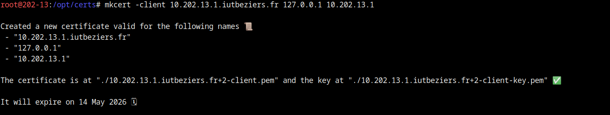
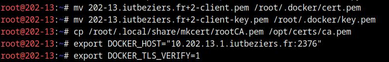
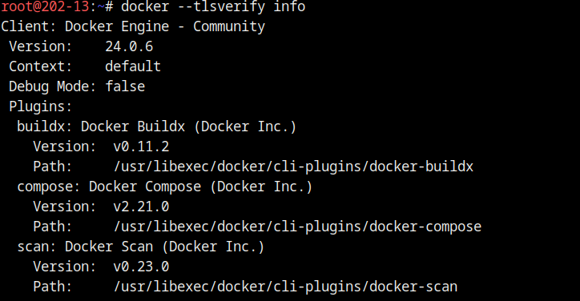

# Build automatisé d’images Docker avec Gitlab
## Installation dockerfile sur ma machine


## 2 Installation d’un runner Gitlab sur ma machine


## 3 Accès au daemon Docker par une socket TLS

**1 - Installez mkcert pour pouvoir générer des certificats TLS pour Docker**


**2 - Générez un certificat pour votre machine**


**3 - Modifs le daemon Docker**









## 4 Création de runners Gitlab sur gitlab.com ou gitlab.iutbeziers.fr
```cmd
gitlab-runner register -n \
--url "https://gitlab.iutbeziers.fr/" \
--registration-token glrt-5ANxYhW4XhYSb7rrioz- \
--executor shell \
--description "runner shell portainer1"
```


## 4.1 Variables d’environnement pour le runner


## 4.2 Création d’un runner Gitlab shell sur votre machine


## 4.3 Création d’un runner Gitlab D.I.N.D (Docker in Docker)
```cmd
sudo gitlab-runner register -n \
--url "https://gitlab.iutbeziers.fr/" \
--registration-token glrt-5ANxYhW4XhYSb7rrioz- \
--executor docker \
--description "docker runner dind portainer1" \
--docker-image "docker:24.0.5" \
--docker-privileged
```


**5. Faites une modification sur ce projet pour arrêter le deploiement de l’image sur le registry de l’IUT.**

- [../script/.gitlab-ci.yml](voici le script)


