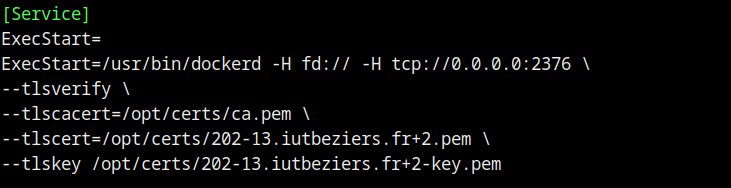

# Build automatisé d’images Docker avec Gitlab
## Installation dockerfile sur ma machine

## 2 Installation d’un runner Gitlab sur ma machine

## 3 Accès au daemon Docker par une socket TLS

**1 - Installez mkcert pour pouvoir générer des certificats TLS pour Docker**

**2 - Générez un certificat pour votre machine**

**3 - Modifs le daemon Docker**

