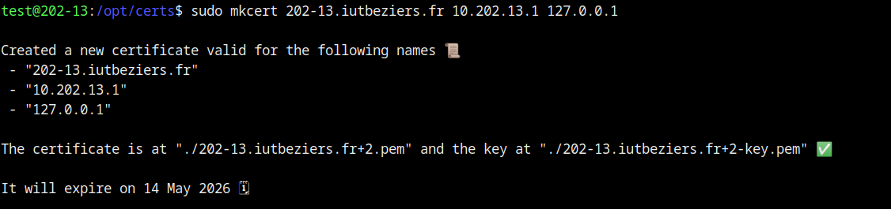

# Build automatisé d’images Docker avec Gitlab
## I - Installation dockerfile sur ma machine


### 2 Installation d’un runner Gitlab sur ma machine


### 3 Accès au daemon Docker par une socket TLS

**1 - Installez mkcert pour pouvoir générer des certificats TLS pour Docker**


**2 - Générez un certificat pour votre machine**



**3 - Modifs le daemon Docker**


## 4 Création de runners Gitlab sur gitlab.com ou gitlab.iutbeziers.fr
```cmd
gitlab-runner register -n \
--url "https://gitlab.iutbeziers.fr/" \
--registration-token glrt-5ANxYhW4XhYSb7rrioz- \
--executor shell \
--description "runner shell portainer1"
```


## 4.1 Variables d’environnement pour le runner


## 4.2 Création d’un runner Gitlab shell sur votre machine


## 4.3 Création d’un runner Gitlab D.I.N.D (Docker in Docker)
```cmd
sudo gitlab-runner register -n \
--url "https://gitlab.iutbeziers.fr/" \
--registration-token glrt-5ANxYhW4XhYSb7rrioz- \
--executor docker \
--description "docker runner dind portainer1" \
--docker-image "docker:24.0.5" \
--docker-privileged
```


**3. Commentez et expliquer ce fichier gitlab-ci.yaml**

[Voici le fichier yml](../script/.gitlab-ci.yml)

Ce fichier GitLab CI/CD automatisera le processus de construction, de test, de déploiement et d'analyse de sécurité des images Docker pour le projet spécifié.

- Variables:
        Définit plusieurs variables d'environnement nécessaires pour la configuration du Docker, l'authentification au registre Docker, etc. Dans mon cas j'ai utilisé l'authentification du registry de l'iut.

- Stages:
        Définit les différentes étapes du pipeline CI/CD. Chaque étape représente une phase distincte du processus, telles que la construction de l'image, les tests, le déploiement, et la numérisation des conteneurs.

- Before_script:
        Configure l'environnement avant l'exécution du script. Il crée un répertoire pour les certificats Docker, écrit les fichiers nécessaires, puis utilise docker login pour s'authentifier auprès d'un registre Docker (iut registry).

- Build_image Stage:
        Construit une image Docker en utilisant le fichier Dockerfile dans le répertoire actuel. L'image est ensuite taguée et stockée dans un registre Docker spécifié (iut registry).

- Test Stage:
        Exécute des scripts de test. Dans cet exemple, il imprime simplement un message, mais cela pourrait inclure des tests unitaires, d'intégration, etc.

- Deploy Stage:
        Pousse l'image Docker construite précédemment dans le registre Docker spécifié. Ensuite, il se déconnecte du registre et supprime les certificats Docker.

- Container_Scanning Stage:
        Effectue une analyse de sécurité des vulnérabilités dans l'image Docker à l'aide de Trivy. Il configure les variables nécessaires pour l'authentification auprès du registre, spécifie l'image à analyser, et génère un rapport de numérisation qui est sauvegardé comme artefact.

- Cache:
        Utilise la fonction de mise en cache pour stocker localement certaines données, telles que la base de données de vulnérabilités de Trivy, afin d'accélérer les analyses futures.

- Commentaires:
        Certains éléments du fichier sont commentés (#) pour désactiver ou expliquer des parties du code. Par exemple, la ligne avec include est commentée, indiquant qu'elle est actuellement désactivée.

**4. Faites valider votre chaine de build par votre enseignant.**


**5. Faites une modification sur ce projet pour arrêter le deploiement de l’image sur le registry de l’IUT.**


